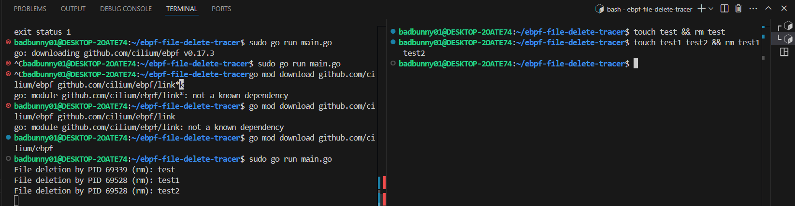
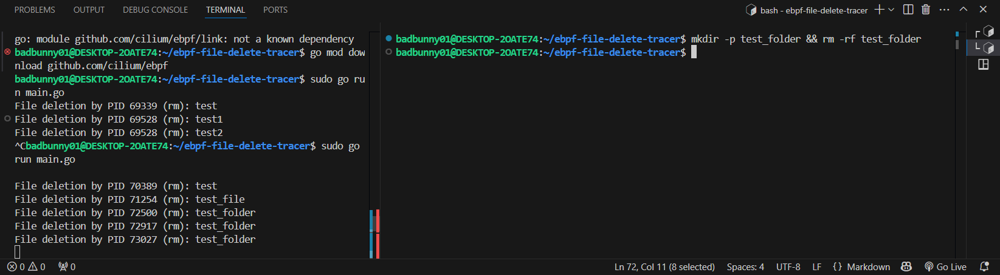

# Summary
    eBPF script to detect file deletions on Linux systems with kernel traces and diplaying them with user space program


## Installation
1. **Install Go**: Follow the instructions on the [official Go website](https://golang.org/doc/install). In Ubuntu/Debian you can also install go as follows:
    ```sh
    sudo apt install golang-go
    echo 'export GOPATH=$HOME/go' >> ~/.profile
    echo 'export PATH=$GOPATH/bin:$PATH' >> ~/.profile
    source ~/.profile
    ```
2. **Install clang and llvm**:
    ```sh
    sudo apt-get install clang llvm
    ```
3. **Install libbpf**:
    ```sh
    sudo apt-get install libbpf-dev
    ```
4. **Clone the repository**:
    ```sh
    git clone https://github.com/srodi/ebpf-file-delete-tracer.git
    cd ebpf-file-delete-tracer
    ```

## Usage
1. **Compile the eBPF program**:
    ```sh
    clang -O2 -g -target bpf -c trace_file_delete.c -o trace_file_delete.o
    ```
2. **Run the Go program**:
    ```sh
    sudo go run main.go
    ```
## Code Explanation

The implementation for the eBPF program is found in [trace_file_delete.c](trace_file_delete.c) and the implementation for the user space application is in [main.go](main.go).

## Quickstart

Install and use `bpftool`. 4. In Linux distributions this package is provided by `linux-tools-common`

```sh
sudo apt-get install linux-tools-common
```

If you are using `WSL2` you will have to install `bpftool` manually

```sh
git clone --recurse-submodules https://github.com/libbpf/bpftool.git
cd bpftool/src
sudo make install
```

Generate `vmlinux.h` using `bpftools`

```sh
bpftool btf dump file /sys/kernel/btf/vmlinux format c > vmlinux.h
```

## Compile and load eBPF program

Compile the `C` code 

```sh
clang -O2 -g -target bpf -c trace_file_delete.c -o trace_file_delete.o
```

## Demo:




## Attribution

This eBPF implementation is based on the tutorial by [SRodi]([https://github.com/SRodi]) found here: [[TutorialURL](https://www.srodi.com/posts/how-to-write-and-run-an-ebpf-program-on-linux/)].